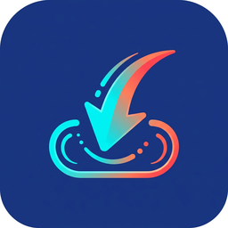
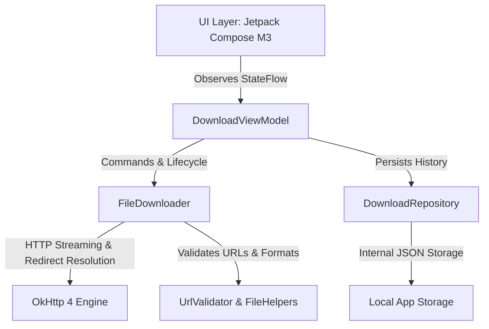

<div align="center">



# ⚡ DUDDY

### **Fast • Expressive • Streamlined Android File Downloader**

*A modern Android application engineered with Material 3 Expressive design principles, featuring real-time continuous streaming, intelligent short-link resolution, and zero-bloat performance.*

---

[-3DDC84?style=for-the-badge&logo=android&logoColor=white)](https://developer.android.com)
[](https://kotlinlang.org)
[](https://developer.android.com/jetpack/compose)
[](.github/workflows/build-and-release.yml)
[](LICENSE)

<br/>

<a href="#-key-features">Key Features</a> •
<a href="#-design--experience">Design & UI</a> •
<a href="#-architecture">Architecture</a> •
<a href="#-quick-start">Quick Start</a> •
<a href="#-automated-github-releases">1-Click Release</a> •
<a href="#-project-structure">Structure</a> •
<a href="#-contributing">Contributing</a>

<br/>
<br/>


</div>

<br/>

## 📖 Overview

**Duddy** is built for users who want a direct, high-efficiency file download manager without the clutter. Unlike heavy legacy download managers packed with unwanted background services and complex pause/resume state machines, Duddy prioritizes **pure continuous throughput**, **accurate live telemetry**, and an **uncompromising Material 3 Expressive interface**.

From intelligent short-link redirect discovery to real-time byte transfers and instant file previews, Duddy delivers an effortless downloading experience.

---

## ✨ Key Features

### 🔗 1. Link-Only Input Engine with Deep Diagnostics
- **Strict Link Verification**: Filters out plain text, typos, non-web URLs (`file://`, `javascript:`, etc.) in real time.
- **Short-Link & Redirect Unwrapper**: Seamlessly resolves shortened links (`bit.ly`, `tinyurl.com`, `t.co`, `goo.gl`, etc.) and extracts the genuine destination filename and MIME type from `Content-Disposition` or final URL paths.
- **Contextual Error Diagnostics**: Distinguishes between expired short links, HTTP 404 (Not Found), 403 (Access Denied), SSL/TLS handshake failures, and HTML landing pages (with helpful guidance to provide direct file links).
- **1-Tap Quick Actions**: One-touch **Paste from Clipboard**, clear button, and pre-configured **Sample Download Chips** (PDF, Audio, Image, Speed Test binary).

### 📊 2. Expressive Live Progress Tracker
- **Distinct Curved File Pill**: The resolved file name is showcased **directly on top of the progress bar in a distinct-colored rectangular shape with very curved edges** (`RoundedCornerShape(24.dp)`), including a dynamic file-type badge (PDF, ZIP, Audio, Image, Video, APK).
- **Continuous Pure Stream**: Intentionally designed without pause/resume overhead for optimal I/O throughput and instant cancellation cleanup.
- **Comprehensive Metrics**: Live download speed (MB/s with rolling average), percentage, downloaded vs. total bytes, and intelligent ETA estimation.

### 📁 3. Integrated Download Library & Native Sharing
- **Secure File Access**: Integrates with Android's `FileProvider` so downloaded files can be launched in any compatible viewer with zero permission friction.
- **Android Share Sheet**: Share files directly to Telegram, Drive, Gmail, or local storage in one tap.
- **History Management**: Keep track of completed downloads with file sizes, timestamps, and quick deletion options.

---

## 🎨 Design & Experience

Duddy is crafted following the latest **Material Design 3 Expressive guidelines**:

| Component | Expressive Design Choice | Purpose |
| :--- | :--- | :--- |
| **File Name Pill** | `RoundedCornerShape(24.dp)` with distinct violet/indigo accent container | Emphasizes the file identity directly above the progress bar |
| **Edge-to-Edge** | Full viewport bleed using `WindowInsets.safeDrawing` | Fluid visual immersion across modern Android devices |
| **Micro-Animations** | Spring transitions and animated progress state | Smooth, organic feedback without UI stutter |
| **Adaptive Layout** | Responsive container (`Modifier.widthIn(max = 680.dp)`) | Flawless ergonomics on phones, foldables, and tablets |

---

## 🏗 Architecture & Tech Stack

Duddy follows **Clean Architecture** and modern Android **MVVM** principles:



### Technology Highlights

- **Language**: 100% [Kotlin](https://kotlinlang.org/) with Coroutines & StateFlow.
- **UI Framework**: [Jetpack Compose](https://developer.android.com/jetpack/compose) with Material 3 components.
- **Network Stack**: [OkHttp 4](https://square.github.io/okhttp/) with custom buffer streams and automatic SSL/HTTP redirect following.
- **File Management**: Android Jetpack `FileProvider` for secure content URI sharing.
- **Testing**: Local JVM Unit tests + [Robolectric](https://robolectric.org/) testing for UI string and application logic.
- **CI/CD Pipeline**: GitHub Actions with automated Gradle caching, APK compilation, and GitHub Release deployment.

---

## 🚀 Quick Start

### Prerequisites
- **Android Studio Ladybug** (or newer)
- **JDK 17** or **JDK 21**
- **Android SDK Platform 36** (minimum API 24 supported)

### 1. Clone the Repository
```bash
git clone https://github.com/your-username/duddy.git
cd duddy
```

### 2. Build the Debug APK
```bash
./gradlew assembleDebug
```
The generated APK will be available at:
```
app/build/outputs/apk/debug/app-debug.apk
```

### 3. Run Tests
```bash
# Execute local unit and Robolectric tests
./gradlew testDebugUnitTest
```

---

## 📦 Automated GitHub Releases

This repository includes a pre-configured, on-click GitHub Actions workflow (`.github/workflows/build-and-release.yml`):

```yaml
# Triggered on click via GitHub UI
on:
  workflow_dispatch:
    inputs:
      version_name:
        description: 'Release Version Tag (e.g., v1.0.0)'
      custom_notes:
        description: 'Optional custom release notes'
```

### How to Create a Release:
1. Navigate to the **Actions** tab in your GitHub repository.
2. Select **"Build Duddy APK & Release"** on the left.
3. Click the **"Run workflow"** button.
4. *(Optional)* Enter a version tag (e.g. `v1.0.0`) and custom release notes.
5. Hit **"Run workflow"**:
   - The workflow will automatically compile the APK.
   - It renames the binary to `Duddy-<tag>.apk`.
   - It stores the APK in the workflow **Artifacts**.
   - It publishes an official **GitHub Release** with auto-generated commit changelogs and attaches the APK!

---

## 📂 Project Structure

```
duddy/
├── .github/
│   └── workflows/
│       └── build-and-release.yml     # Automated CI/CD build & release pipeline
├── app/
│   ├── src/
│   │   ├── main/
│   │   │   ├── java/com/example/
│   │   │   │   ├── data/             # Download repository & local storage
│   │   │   │   ├── model/            # DownloadState, History, & Validation models
│   │   │   │   ├── network/          # FileDownloader with OkHttp stream flow
│   │   │   │   ├── ui/               # Compose screens, components, and Theme
│   │   │   │   │   ├── components/   # FileNameBadge, TrackerCard, UrlInput, History
│   │   │   │   │   └── theme/        # Material 3 Expressive colors & typography
│   │   │   │   ├── util/             # UrlValidator & FileHelpers (FileProvider)
│   │   │   │   └── MainActivity.kt   # Edge-to-edge Compose entry point
│   │   │   ├── res/                  # Vector drawables, adaptive mipmaps, & strings
│   │   │   └── AndroidManifest.xml   # Permissions & FileProvider declarations
│   │   └── test/                     # Unit and Robolectric test suites
│   └── build.gradle.kts              # Application build configuration
├── docs/
│   └── assets/                       # High-res banners and promotional assets
├── gradle/                           # Version catalog (libs.versions.toml) & wrapper
├── gradlew                           # Executable Gradle wrapper
└── README.md                         # Project documentation
```

---

## 🤝 Contributing

Contributions make the open-source community an amazing place to learn, inspire, and create. Any contributions you make are **greatly appreciated**.

1. Fork the Project.
2. Create your Feature Branch (`git checkout -b feature/AmazingFeature`).
3. Commit your Changes (`git commit -m 'Add some AmazingFeature'`).
4. Push to the Branch (`git push origin feature/AmazingFeature`).
5. Open a Pull Request.

---

## 📄 License

Distributed under the Apache License, Version 2.0. See [`LICENSE`](LICENSE) for more information.

<div align="center">
  <sub>Crafted with ❤️ using Jetpack Compose and Material 3 Expressive.</sub>
</div>
